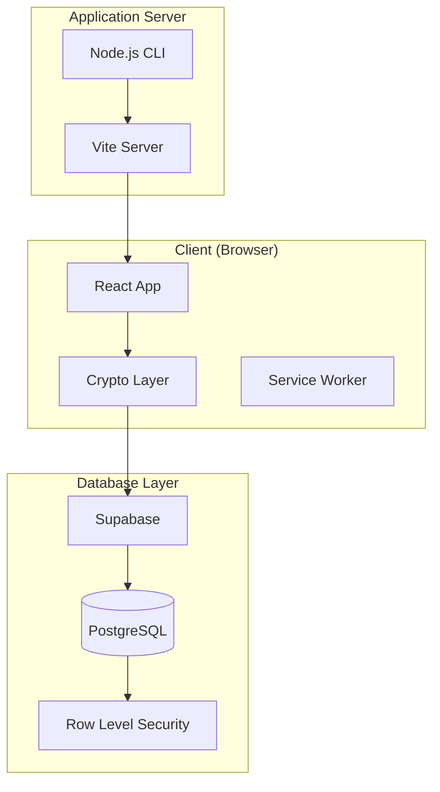
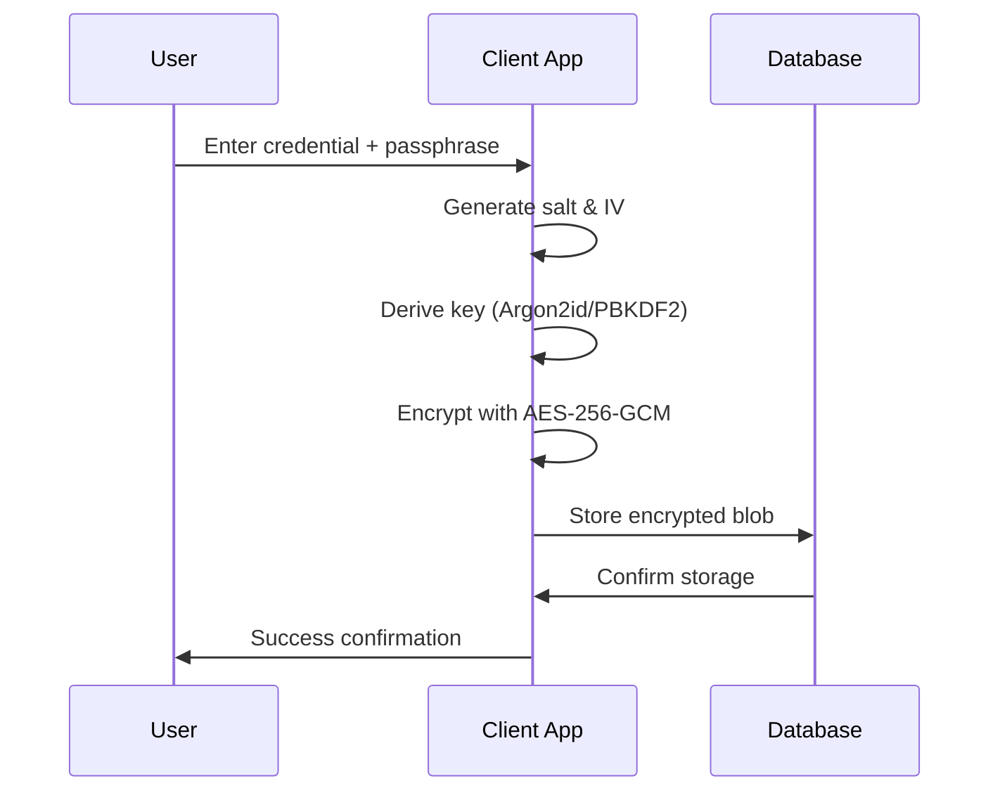

# 🔐 Keyper - Project Overview

<div align="center">


**✨ Modern Self-Hosted Credential Management with Zero-Knowledge Encryption ✨**

[](https://www.npmjs.com/package/@pinkpixel/keyper)
[](LICENSE)
[](https://reactjs.org/)
[](https://www.typescriptlang.org/)

_Dream it, Pixel it_ - **Made with ❤️ by Pink Pixel**

</div>

---

## 📋 Table of Contents

- [🎯 Project Purpose](#-project-purpose)
- [🏗️ Architecture Overview](#️-architecture-overview)
- [🔒 Security Implementation](#-security-implementation)
- [🛠️ Technology Stack](#️-technology-stack)
- [📁 Project Structure](#-project-structure)
- [🗄️ Database Schema](#️-database-schema)
- [🎨 User Interface](#-user-interface)
- [⚡ Performance Features](#-performance-features)
- [📱 Progressive Web App](#-progressive-web-app)
- [🚀 Deployment & Distribution](#-deployment--distribution)
- [🧪 Testing Strategy](#-testing-strategy)
- [📊 Current Status](#-current-status)
- [🔮 Future Roadmap](#-future-roadmap)

---

## 🎯 Project Purpose

**Keyper** is a modern, self-hosted credential management application designed to provide complete control over sensitive data while maintaining enterprise-grade security. The project addresses the growing need for secure credential storage with a zero-knowledge architecture that ensures even the database administrator cannot access user secrets.

### Key Objectives

- 🔒 **Zero-Knowledge Security**: All encryption happens client-side
- 🏠 **Self-Hosted Control**: Complete data ownership and privacy
- 👤 **Multi-User Support**: Secure isolation for multiple users
- 📱 **Modern Experience**: Progressive Web App with native-like features
- ⚡ **High Performance**: Optimized loading and runtime performance
- 🎨 **Beautiful UI**: Glassmorphism design with accessibility in mind

---

## 🏗️ Architecture Overview

### System Architecture



### Core Design Principles

1. **Zero-Knowledge Architecture**: Encryption/decryption occurs exclusively in the browser
2. **Stateless Backend**: Database stores only encrypted blobs and metadata
3. **User Isolation**: Multi-tenant support with strict data separation
4. **Progressive Enhancement**: Works offline with cached data
5. **Security First**: Multiple layers of protection and validation

---

## 🔒 Security Implementation

### Cryptographic Stack

| Component           | Implementation                           | Purpose                            |
| ------------------- | ---------------------------------------- | ---------------------------------- |
| **Key Derivation**  | Argon2id (preferred) / PBKDF2 (fallback) | Password-to-key transformation     |
| **Encryption**      | AES-256-GCM                              | Authenticated symmetric encryption |
| **Salt Generation** | Crypto.getRandomValues()                 | Unique salt per credential         |
| **IV Generation**   | Crypto.getRandomValues()                 | Unique initialization vector       |

### Security Features

- 🔐 **End-to-End Encryption**: All sensitive data encrypted before database storage
- 🔑 **Master Passphrase Protection**: Single passphrase controls vault access
- ⏰ **Auto-Lock**: 15-minute inactivity timeout with activity detection
- 🛡️ **Row Level Security**: Database-level access control
- 🔒 **Content Security Policy**: Browser-level protection against XSS
- 🚫 **No Telemetry**: Zero tracking or data collection

### Encryption Workflow



---

## 🛠️ Technology Stack

### Frontend Technologies

| Technology       | Version | Purpose                                      |
| ---------------- | ------- | -------------------------------------------- |
| **React**        | 19.1.1  | Modern UI framework with concurrent features |
| **TypeScript**   | 5.8.3   | Type safety and developer experience         |
| **Vite**         | 7.0.6   | Lightning-fast build tool and dev server     |
| **Tailwind CSS** | 3.4.11  | Utility-first styling framework              |
| **Radix UI**     | Various | Unstyled, accessible UI primitives           |
| **shadcn/ui**    | Latest  | Pre-built component library                  |
| **Electron**     | 33.3.0  | Cross-platform desktop app runtime           |

### Backend & Database

| Technology         | Version | Purpose                                    |
| ------------------ | ------- | ------------------------------------------ |
| **Node.js**        | 18+     | Runtime for CLI and build tools            |
| **Supabase**       | 2.53.0  | Backend-as-a-Service platform              |
| **PostgreSQL**     | 15+     | Relational database with advanced features |
| **Docker / nginx** | 1.27+   | Containerised SPA serving                  |

### Security & Cryptography

| Library            | Purpose                                 |
| ------------------ | --------------------------------------- |
| **argon2-browser** | Memory-hard key derivation              |
| **Web Crypto API** | Browser-native cryptographic operations |
| **Zod**            | Runtime type validation                 |

### Development Tools

| Tool         | Purpose                      |
| ------------ | ---------------------------- |
| **ESLint**   | Code linting and quality     |
| **Vitest**   | Unit and integration testing |
| **Wrangler** | Cloudflare deployment        |

---

## 📁 Project Structure

```
keyper/
├── 📁 bin/                    # CLI executable
│   └── keyper.js             # Node.js server launcher
├── 📁 electron/               # Electron main-process source
│   ├── main.ts               # app:// protocol, security headers
│   ├── preload.ts            # context-bridge (window.keyperElectron)
│   └── tsconfig.json         # CommonJS TypeScript config
├── 📁 electron-dist/          # Compiled Electron output (git-ignored)
├── 📁 dist-electron/          # electron-builder output — installers (git-ignored)
├── 📄 electron-builder.yml    # Packager config (AppImage, deb, NSIS, DMG)
├── 📄 Dockerfile              # Multi-stage Node→nginx image
├── 📄 nginx.conf              # SPA routing, WASM MIME, security headers
├── 📄 docker-compose.yml      # Single-command stack launch
├── 📁 docs/                   # Documentation
├── 📁 public/                 # Static assets
│   ├── logo.png              # Application logo
│   ├── favicon.ico           # Browser favicon
│   └── manifest.json         # PWA manifest
├── 📁 src/                    # Source code
│   ├── 📁 components/         # React components
│   │   ├── 📁 dashboard/      # Dashboard components
│   │   ├── 📁 ui/            # UI primitives
│   │   ├── PassphraseGate.tsx # Vault unlock component
│   │   ├── Settings.tsx       # Configuration interface
│   │   └── SelfHostedDashboard.tsx # Main app component
│   ├── 📁 crypto/             # Cryptography layer
│   │   ├── crypto.ts         # Core encryption functions
│   │   ├── encoding.ts       # Data encoding utilities
│   │   └── types.ts          # Crypto type definitions
│   ├── 📁 hooks/              # React hooks
│   ├── 📁 integrations/       # External service integrations
│   │   └── 📁 supabase/       # Supabase client
│   ├── 📁 lib/                # Utility libraries
│   ├── 📁 pages/              # Route components
│   ├── 📁 security/           # Security utilities
│   ├── 📁 services/           # Business logic
│   └── 📁 types/              # TypeScript definitions
├── 📁 supabase/               # Database configuration
├── 📄 supabase-setup.sql      # Database initialization script
├── 📄 package.json            # Project configuration
├── 📄 vite.config.ts          # Build configuration
├── 📄 tailwind.config.ts      # Styling configuration
├── 📄 README.md               # User documentation
├── 📄 SELF-HOSTING.md         # Deployment guide
├── 📄 CONTRIBUTING.md         # Contributor guide
└── 📄 LICENSE                 # Apache 2.0 license
```

---

## 🗄️ Database Schema

### Core Tables

#### **credentials**

Primary table for encrypted credential storage:

```sql
CREATE TABLE credentials (
  id UUID PRIMARY KEY DEFAULT gen_random_uuid(),
  user_id TEXT NOT NULL DEFAULT 'self-hosted-user',
  title TEXT NOT NULL,
  description TEXT,
  credential_type TEXT NOT NULL CHECK (credential_type IN ('api_key', 'login', 'secret', 'token', 'certificate')),
  priority TEXT NOT NULL DEFAULT 'medium' CHECK (priority IN ('low', 'medium', 'high', 'critical')),
  username TEXT,
  url TEXT,
  tags TEXT[] DEFAULT '{}',
  category TEXT,
  notes TEXT,
  expires_at TIMESTAMP WITH TIME ZONE,
  last_accessed TIMESTAMP WITH TIME ZONE,
  created_at TIMESTAMP WITH TIME ZONE DEFAULT NOW(),
  updated_at TIMESTAMP WITH TIME ZONE DEFAULT NOW(),

  -- Encrypted storage
  secret_blob JSONB NOT NULL,
  encrypted_at TIMESTAMP WITH TIME ZONE DEFAULT NOW()
);
```

#### **vault_config**

Secure key management configuration with dual authentication systems:

````sql
CREATE TABLE vault_config (
  id UUID PRIMARY KEY DEFAULT gen_random_uuid(),
  user_id TEXT NOT NULL DEFAULT 'self-hosted-user',

  -- New bcrypt-only system for simplified security
  raw_dek BYTEA,                    -- Plain DEK for new users
  bcrypt_hash TEXT,                 -- Bcrypt hash of master passphrase

  -- Legacy wrapped DEK system (backwards compatibility)
  wrapped_dek JSONB,                -- Encrypted DEK for existing users

  created_at TIMESTAMP WITH TIME ZONE DEFAULT NOW(),
  updated_at TIMESTAMP WITH TIME ZONE DEFAULT NOW(),
  UNIQUE(user_id)
);```

#### **categories**
Organization and categorization system:

```sql
CREATE TABLE categories (
  id UUID PRIMARY KEY DEFAULT gen_random_uuid(),
  user_id TEXT NOT NULL DEFAULT 'self-hosted-user',
  name TEXT NOT NULL,
  color TEXT DEFAULT '#6366f1',
  icon TEXT DEFAULT 'folder',
  description TEXT,
  created_at TIMESTAMP WITH TIME ZONE DEFAULT NOW(),
  updated_at TIMESTAMP WITH TIME ZONE DEFAULT NOW(),
  UNIQUE(user_id, name)
);
````

### Security Features

- ✅ **Row Level Security (RLS)** enabled on all tables
- ✅ **Comprehensive policies** for multi-user isolation
- ✅ **Performance indexes** on frequently queried columns
- ✅ **Automatic triggers** for timestamp maintenance
- ✅ **Helper functions** for statistics and verification

---

## 🎨 User Interface

### Design System

- **Theme**: Dark-first with glassmorphism aesthetics
- **Colors**: Cyan-focused palette with semantic color coding
- **Typography**: Clean, readable fonts with proper hierarchy
- **Layout**: Responsive grid system with mobile-first approach
- **Accessibility**: ARIA labels, keyboard navigation, screen reader support

### Key Components

| Component            | Purpose                   | Features                            |
| -------------------- | ------------------------- | ----------------------------------- |
| **PassphraseGate**   | Vault security checkpoint | Auto-lock, biometric support        |
| **DashboardHeader**  | Navigation and branding   | Search, user profile, actions       |
| **CredentialsGrid**  | Main credential display   | Filtering, sorting, infinite scroll |
| **CredentialModal**  | Detailed credential view  | Edit, copy, security indicators     |
| **SearchAndFilters** | Advanced filtering system | Real-time search, tag filtering     |

### Responsive Behavior

- **Mobile**: Touch-optimized interfaces, swipe gestures
- **Tablet**: Adaptive layouts, contextual toolbars
- **Desktop**: Full feature set, keyboard shortcuts
- **Large Screens**: Multi-column layouts, enhanced workflows

---

## ⚡ Performance Features

### Build Optimization

- **Code Splitting**: Automatic route and component chunking
- **Tree Shaking**: Dead code elimination
- **Asset Optimization**: Image compression and format selection
- **Bundle Analysis**: Chunk size monitoring and optimization

### Runtime Performance

- **Lazy Loading**: Deferred component loading
- **Memoization**: React.memo and useMemo optimization
- **Virtual Scrolling**: Efficient large list rendering
- **Caching**: Service Worker and HTTP caching strategies

### Cryptographic Performance

- **Argon2 Optimization**: Memory and CPU tuning
- **PBKDF2 Fallback**: Compatibility for older devices
- **Streaming Crypto**: Efficient handling of large datasets
- **Worker Threads**: Non-blocking encryption operations

---

## 📱 Progressive Web App

### PWA Features

- ✅ **Installable**: Add to home screen on all platforms
- ✅ **Offline Support**: Core functionality without internet
- ✅ **Push Notifications**: Security alerts and reminders
- ✅ **Background Sync**: Data synchronization when online
- ✅ **App Shell**: Fast loading with cached resources

### Service Worker Strategy

```javascript
// Workbox configuration
workbox: {
  globPatterns: ['**/*.{js,css,html,ico,png,svg}'],
  runtimeCaching: [
    {
      urlPattern: /^https:\/\/.*\.supabase\.co\/.*/i,
      handler: 'NetworkFirst',
      options: {
        cacheName: 'supabase-cache',
        expiration: {
          maxEntries: 10,
          maxAgeSeconds: 60 * 60 * 24 // 24 hours
        }
      }
    }
  ]
}
```

---

## 🚀 Deployment & Distribution

### Distribution Channels

1. **NPM Package**: Global installation via `npm install -g @pinkpixel/keyper`
2. **Direct Download**: GitHub releases with pre-built desktop installers
3. **Docker Image**: Containerized deployment (nginx-based, production-ready)
4. **Cloud Deployment**: Cloudflare Pages, Netlify, Vercel support
5. **Electron Desktop App**: Native app for Linux, Windows, and macOS

### CLI Integration

```bash
# Global installation
npm install -g @pinkpixel/keyper

# Quick start
keyper                    # Default port 4173
keyper --port 3000        # Custom port
keyper --help             # Show help
```

### Docker Deployment

```bash
# Clone and start with Docker Compose (default port 8080)
git clone https://github.com/pinkpixel-dev/keyper.git
cd keyper
docker compose up -d

# Custom port
HOST_PORT=3030 docker compose up -d

# Or run directly
docker build -t keyper .
docker run -d -p 8080:80 --name keyper --restart unless-stopped keyper
```

The container serves the compiled Vite/React SPA on port 80 internally. No Node.js or environment variables required on the host — all Supabase credentials are entered in-app and stored in browser `localStorage`.

### Electron Desktop App

Pre-built installers are available on the [GitHub Releases](https://github.com/pinkpixel-dev/keyper/releases) page:

| Platform | Format                  | Architecture  |
| -------- | ----------------------- | ------------- |
| Linux    | AppImage                | x86_64, ARM64 |
| Linux    | `.deb`                  | x86_64, ARM64 |
| Windows  | NSIS installer (`.exe`) | x64           |
| macOS    | DMG                     | Universal     |

To build from source:

```bash
npm run electron:build:linux   # AppImage + deb
npm run electron:build:win     # NSIS installer
npm run electron:build:mac     # DMG (must run on macOS)
```

### Self-Hosting Options

- **Local Network**: Internal company deployment
- **Cloud VPS**: DigitalOcean, AWS, Google Cloud
- **Edge Networks**: Cloudflare Workers/Pages
- **Container Platforms**: Docker, Kubernetes

---

## 🧪 Testing Strategy

### Test Coverage

| Test Type             | Framework                | Coverage                    |
| --------------------- | ------------------------ | --------------------------- |
| **Unit Tests**        | Vitest                   | Core functions, utilities   |
| **Integration Tests** | Vitest + Testing Library | Component interactions      |
| **E2E Tests**         | Playwright (planned)     | Full user workflows         |
| **Security Tests**    | Custom                   | Encryption/decryption flows |

### Continuous Integration

- **GitHub Actions**: Automated testing on PRs
- **Build Verification**: Cross-platform compatibility
- **Security Scanning**: Dependency vulnerability checks
- **Performance Monitoring**: Bundle size tracking

---

## 📊 Current Status

### Version Information

- **Current Version**: 1.1.0
- **Release Date**: March 2026
- **Last Updated**: March 2026
- **Status**: Stable Production Release 🟢
- **License**: Apache 2.0
- **Emergency System**: Advanced troubleshooting enabled ⚡
- **Local Database Support**: Full compatibility with local Supabase instances 🌐

### Feature Completeness

| Feature Category   | Status      | Notes                       |
| ------------------ | ----------- | --------------------------- |
| **Core Security**  | ✅ Complete | Zero-knowledge encryption   |
| **User Interface** | ✅ Complete | Full responsive design      |
| **Database Layer** | ✅ Complete | Comprehensive schema        |
| **PWA Features**   | ✅ Complete | Full offline support        |
| **CLI Tools**      | ✅ Complete | Multi-platform support      |
| **Docker Build**   | ✅ Complete | nginx-based container       |
| **Desktop App**    | ✅ Complete | Electron v33, all platforms |
| **Documentation**  | ✅ Complete | Comprehensive guides        |

### Known Limitations

- **Mobile Biometrics**: Planned for a future release
- **Team Sharing**: Enterprise feature roadmap
- **API Access**: External integration support
- **Audit Logging**: Enhanced security tracking

---

## 🔮 Future Roadmap

### Version 1.2 (Next)

- 🔐 **Biometric Authentication**: Touch/Face ID support
- 📊 **Enhanced Analytics**: Usage patterns and insights
- 🔄 **Automatic Backups**: Encrypted cloud backup options
- 🚀 **Performance Optimizations**: Further speed improvements

### Version 1.2 (Q1 2026)

- 👥 **Team Collaboration**: Secure credential sharing
- 🔗 **External Integrations**: API access and webhooks
- 📱 **Native Mobile Apps**: iOS and Android applications
- 🛡️ **Advanced Security**: Hardware key support

### Version 2.0 (Q2 2026)

- 🏢 **Enterprise Features**: SSO, LDAP integration
- 🔍 **Advanced Audit**: Comprehensive logging and compliance
- 🌐 **Multi-Instance**: Federated deployment support
- 🤖 **AI-Powered**: Smart categorization and security insights

---

## 🤝 Contributing

Keyper is an open-source project welcoming contributions from developers worldwide. Please refer to [CONTRIBUTING.md](CONTRIBUTING.md) for detailed guidelines.

### Development Setup

```bash
git clone https://github.com/pinkpixel-dev/keyper.git
cd keyper
npm install
npm run dev
```

### Contribution Areas

- 🐛 **Bug Reports**: Help improve stability
- ✨ **Feature Requests**: Suggest new capabilities
- 📝 **Documentation**: Enhance user guides
- 🔐 **Security**: Cryptographic improvements
- 🎨 **Design**: UI/UX enhancements

---

## 📞 Support & Community

- 🌐 **Website**: [pinkpixel.dev](https://pinkpixel.dev)
- 📧 **Email**: [admin@pinkpixel.dev](mailto:admin@pinkpixel.dev)
- 💬 **Discord**: @sizzlebop
- 🐛 **Issues**: [GitHub Issues](https://github.com/pinkpixel-dev/keyper/issues)
- ☕ **Support**: [Buy me a coffee](https://www.buymeacoffee.com/pinkpixel)

---

<div align="center">

**⭐ Star this project if it helps secure your digital life! ⭐**

_Made with ❤️ by Pink Pixel - Dream it, Pixel it ✨_

</div>
