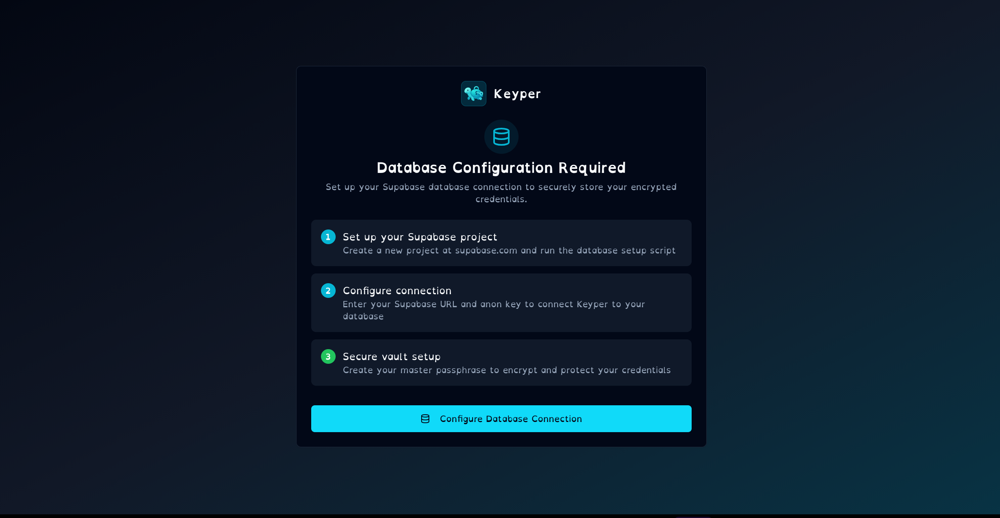
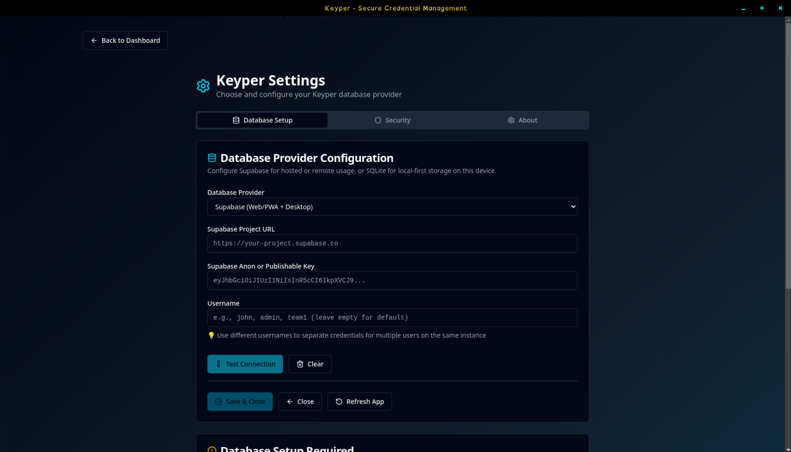
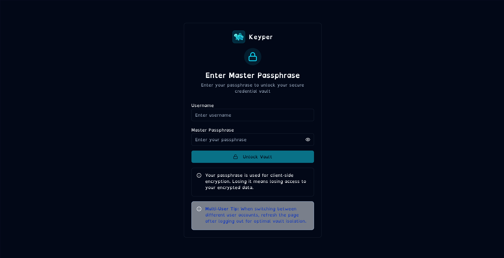
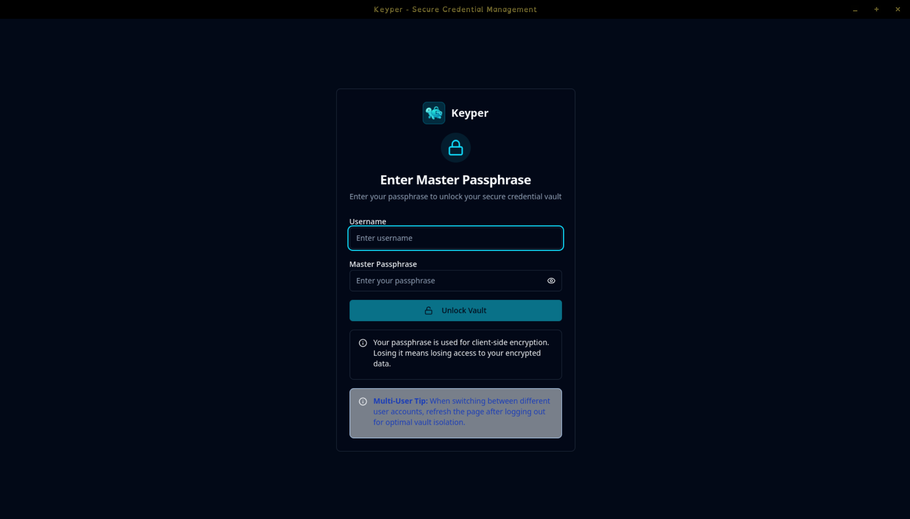
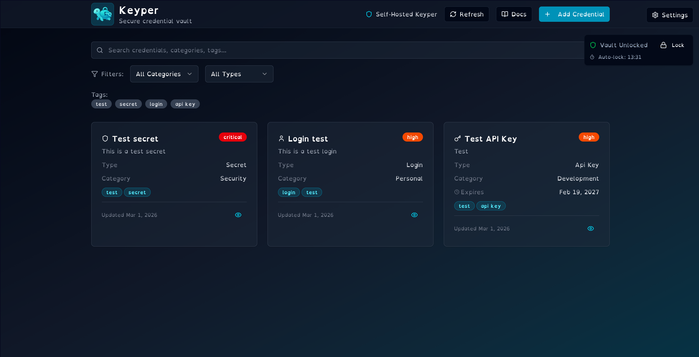

# 🔐 Keyper - Self-Hosted Credential Management

<div align="center">


**✨ Your Credentials. Your Security. Your Rules. ✨**

[](https://www.npmjs.com/package/@pinkpixel/keyper)
[](LICENSE)
[](https://reactjs.org/)
[](https://www.typescriptlang.org/)
[](https://supabase.com/)
[](https://www.sqlite.org/)
[](https://hub.docker.com/)
[](https://www.electronjs.org/)
[](https://web.dev/progressive-web-apps/)

_A modern, secure, self-hosted credential management application for storing and organizing your digital credentials with complete privacy and control._

[🚀 Quick Start](#-quick-start) • [🖼️ Screenshots](#️-screenshots) • [📦 Installation](#-installation) • [🗄️ Setup](#️-database-setup) • [📱 PWA](#-progressive-web-app) • [🔧 Troubleshooting](#-troubleshooting)

</div>

---

## 📥 Download

Desktop installers are available on the **[Keyper website](https://keyper.pinkpixel.dev/getting-started/install-and-run/)**.

| Platform | Package         | Download                                                                                             |
| -------- | --------------- | ---------------------------------------------------------------------------------------------------- |
| 🐧 Linux | AppImage        | [Keyper-1.1.1.AppImage](https://pub-da847cd0fc1045b3a5a7fcc39a3be134.r2.dev/Keyper-1.1.1.AppImage)   |
| 🐧 Linux | `.deb` (x86_64) | [keyper_1.1.1_amd64.deb](https://pub-da847cd0fc1045b3a5a7fcc39a3be134.r2.dev/keyper_1.1.1_amd64.deb) |
| 🐧 Linux | `.deb` (ARM64)  | [keyper_1.1.1_arm64.deb](https://pub-da847cd0fc1045b3a5a7fcc39a3be134.r2.dev/keyper_1.1.1_arm64.deb) |

---

## 🖼️ Screenshots











---

## 🌟 Features

### 🔒 **Secure Credential Storage**

- 🔑 **API Keys** - Store and organize your API credentials
- 🔐 **Login Credentials** - Username/password combinations
- 🤫 **Secrets** - Sensitive configuration values
- 🎫 **Tokens** - Authentication and access tokens
- 📜 **Certificates** - SSL certificates and keys
- 📄 **Documents** - Secure file uploads for `.pdf`, `.doc`, `.docx`, `.odt`, `.txt`, `.md`
- 🧩 **Miscellaneous** - Large multiline secure notes/commands/scripts that don’t fit fixed types

### 🏷️ **Smart Organization**

- 📂 **Categories** - Group credentials by service or type
- 🔖 **Tags** - Flexible labeling system
- ⚡ **Priority Levels** - Low, Medium, High, Critical
- 📅 **Expiration Tracking** - Never miss renewal dates
- 🔍 **Real-time Search** - Find credentials instantly
- 👁️ **Quick Reveal & Copy** - Reveal and copy sensitive values directly from the credential detail view
- 👁️ **Inline Text Document Preview** - Text-like document credentials (`.txt`, `.md`, `text/*`) can be previewed inline in credential detail view
- ⬇️ **Secure Document Download** - All document credentials can be downloaded from detail view

### 🛡️ **Enterprise-Grade Security**

- 🔒 **Row Level Security (RLS)** - Database-level isolation
- 🔐 **End-to-End Encryption** - Client-side encryption, zero-knowledge architecture
- 👤 **Multi-User Support** - Support for multiple users on the same instance
- 🌐 **Secure Connections** - HTTPS/TLS encryption
- 🏠 **Self-Hosted** - Complete control over your data

### 🔐 **Advanced Encryption Features**

- **Zero-Knowledge Architecture** - All encryption happens client-side
- **AES-256-GCM Encryption** - Industry-standard authenticated encryption
- **Argon2id Key Derivation** - Memory-hard, ASIC-resistant (with PBKDF2 fallback)
- **Auto-Lock Protection** - 15-minute inactivity timeout with activity detection
- **Simplified Bcrypt Master Passphrase** - Secure bcrypt-only authentication for new users
- **Backwards Compatibility** - Legacy wrapped DEK system maintained for existing users
- **User-Controlled Reset** - Secure emergency passphrase reset without admin backdoors
- **Database-Only Storage** - No localStorage usage except for database config
- **Professional Security Audit** - EXCELLENT security rating

### 📱 **Modern Experience**

- 🌙 **Dark Theme** - Easy on the eyes
- 📱 **Responsive Design** - Works on all devices
- ⚡ **Progressive Web App** - Install like a native app
- 🚀 **Fast Performance** - Built with Vite and React 19
- 🎨 **Beautiful UI** - Modern glassmorphism design

---

## 🚀 Quick Start

Get Keyper running on your own infrastructure in under 5 minutes!

### Prerequisites

- **Node.js 18+** installed on your system
- **Database (choose one)**:
  - 🗄️ **SQLite (local mode)** — no account or server required, zero configuration, works in browser and Electron desktop
  - ☁️ **Supabase** — free tier works perfectly for hosted/remote/multi-device usage
- **Modern web browser** (Chrome, Firefox, Safari, Edge)

### ⚡ 1-Minute Installation

```bash
# Install Keyper globally
npm install -g @pinkpixel/keyper

# Start the server (default port 4173)
keyper

# Or start with custom port
keyper --port 3000

# Open in your browser
# 🌐 http://localhost:4173 (or your custom port)
```

**That's it!** 🎉 Follow the in-app setup wizard to configure your database (choose **SQLite** for zero-config local storage, or **Supabase** for hosted cloud storage).

### 🌐 Try the Demo

**Want to try Keyper before installing?** Visit our hosted demo:

**🔗** [**keyper.pinkpixel.dev**](https://keyper.pinkpixel.dev)

Just enter your own Supabase credentials and start managing your encrypted credentials instantly! Your data stays completely private since all encryption happens in your browser.

**Demo Usage:**

- ✅ **Completely Secure** - Zero-knowledge architecture means your data never leaves your browser
- ✅ **Real Functionality** - Full Keyper experience with your own Supabase instance
- ✅ **No Registration** - Just bring your Supabase URL and anon/publishable key
- ⚠️ **Demo Limitations** - Recommended for testing and light usage only
- 🏠 **Self-Host for Production** - Install locally for best performance and full control

_Note: The demo uses the same secure architecture as self-hosted Keyper. Your Supabase credentials are stored only in your browser's localStorage and never transmitted to our servers._

---

## 📦 Installation

### Method 1: Global NPM Installation (Recommended)

```bash
npm install -g @pinkpixel/keyper
```

**Available Commands:**

- `keyper` - Start Keyper server
- `keyper --port 3000` - Start on custom port
- `keyper --help` - Show help and usage
- `credential-manager` - Alternative command
- `keyper-dashboard` - Another alternative

### Method 2: NPX (No Installation Required)

```bash
npx @pinkpixel/keyper
```

### Method 3: Local Development

```bash
git clone https://github.com/pinkpixel-dev/keyper.git
cd keyper
npm install
npm run build
npm start
```

### Method 4: 🐳 Docker

Run Keyper as a containerised web app — no Node.js required on the host!

```bash
# Clone the repo
git clone https://github.com/pinkpixel-dev/keyper.git
cd keyper

# Build & start (serves on http://localhost:8080)
docker compose up -d

# Or on a custom port
HOST_PORT=3030 docker compose up -d

# Force rebuild after source changes
docker compose up -d --build

# Stop
docker compose down

# Follow logs
docker compose logs -f
```

To build and run the image directly (without Compose):

```bash
docker build -t keyper .
docker run -d -p 8080:80 --name keyper --restart unless-stopped keyper
```

> **Note:** Keyper stores all configuration (Supabase credentials or SQLite provider selection) in browser `localStorage` — no environment variables or volumes are required.

### Method 5: ⚡ Electron Desktop App

Run Keyper as a native desktop app on **Linux or macOS**!

#### Preview (no packaging)

```bash
git clone https://github.com/pinkpixel-dev/keyper.git
cd keyper
npm install
npm run electron:preview
```

#### Build a distributable installer

```bash
# all platforms (requires the target OS or cross-compile toolchain)
npm run electron:build

# platform-specific
npm run electron:build:linux   # AppImage + deb
npm run electron:build:mac     # DMG + zip (Intel & Apple Silicon)
```

Installers are output to `dist-electron/`.

---

## 🗄️ Database Setup

Keyper supports two database backends — choose the one that fits your workflow:

| Feature                   | SQLite (Local)          | Supabase (Cloud)              |
| ------------------------- | ----------------------- | ----------------------------- |
| Setup required            | None — auto-configured  | Project creation + SQL script |
| Internet connection       | ❌ Not required         | ✅ Required                   |
| Multi-device sync         | ❌ Not supported        | ✅ Supported                  |
| Works in browser/PWA      | ❌ No                   | ✅ Yes                        |
| Works in Electron desktop | ✅ Yes                  | ✅ Yes                        |
| Data location             | Your device (IndexedDB) | Your Supabase project         |

### Option A: SQLite (Local — Zero Config)

1. Start Keyper: `keyper` (Electron desktop) and open the app
2. In the setup wizard, select **"SQLite (Local)"** as your database provider
3. **Master Passphrase**: Create your encryption passphrase
4. **Start Managing**: Add your first encrypted credential! 🎉

> SQLite mode stores your entire encrypted vault (schema, credentials, categories) in your browser's **IndexedDB** automatically — no SQL scripts or external services required.

### Option B: Supabase (Hosted Cloud)

#### Step 1: Create Your Supabase Project

1. Visit [supabase.com](https://supabase.com) and sign up/login
2. Click **"New Project"**
3. Configure your project:
   - **Name**: `keyper-db` (or your preference)
   - **Database Password**: Generate a strong password
   - **Region**: Choose closest to your location

4. Wait 1-2 minutes for setup completion

#### Step 2: Get Your Credentials

1. In Supabase dashboard: **Settings** → **API**
2. Copy these values:
   - **Project URL**: `https://your-project.supabase.co`
   - **anon/public key**: `eyJhbGciOiJIUzI1NiIsInR5cCI6IkpXVCJ9...`

⚠️ **Important**: Use the **anon/public** key, NOT the service_role key!

#### Step 3: Configure Keyper

1. Start Keyper: `keyper`
2. Open [http://localhost:4173](http://localhost:4173)
3. **Database Setup**: Configure your Supabase connection
   - Enter your Supabase URL and anon/publishable key
   - Copy and run the complete SQL setup script in Supabase SQL Editor
   - If you already have an existing Keyper database, run the update script too (`migration-add-document-misc-types.sql`) so `document` and `misc` credential types work
   - The script creates tables with the latest security features:
     - `raw_dek` and `bcrypt_hash` columns for the new simplified security model
     - Backwards compatibility for existing users with legacy `wrapped_dek` system
     - Latest credential type support (`api_key`, `login`, `secret`, `token`, `certificate`, `document`, `misc`)
   - Test the connection

4. **Master Passphrase**: Create your encryption passphrase
   - Choose a strong passphrase (8+ characters recommended)
   - New users get the simplified bcrypt-only authentication system
   - This encrypts all your credentials client-side with secure emergency reset capabilities

5. **Start Managing**: Add your first encrypted credential! 🎉

---

## 📱 Progressive Web App

Keyper works as a Progressive Web App for a native app experience!

### 🖥️ Desktop Installation

1. Open Keyper in Chrome/Edge/Firefox
2. Look for the install icon in the address bar
3. Click to install as a desktop app
4. Access from your applications menu

### 📱 Mobile Installation

1. Open Keyper in your mobile browser
2. Tap the browser menu (⋮)
3. Select **"Add to Home Screen"** or **"Install App"**
4. Access from your home screen

### ✨ PWA Benefits

- 📱 Native app experience
- 🚀 Faster loading times
- 🌐 Offline functionality
- 🔄 Background updates
- 📲 Push notifications (coming soon)

---

## 🔧 Troubleshooting

### Common Issues

**❌ "Connection failed: Database connection failed"**

- Verify URL format - now supports any valid HTTP/HTTPS URL (v1.0.6+)
  - ✅ Cloud: `https://your-project.supabase.co`
  - ✅ Local: `http://localhost:54321`, `http://192.168.1.100:8000`
  - ✅ Custom: `https://supabase.mydomain.com`
- Use **anon/public** key, not service_role
- Check that your Supabase project is active

**❌ "relation 'credentials' does not exist"**

- Run the complete SQL setup script in Supabase SQL Editor
- Ensure the script completed without errors

**❌ New `document` or `misc` credentials fail to save**

- Run the existing-database update script: `migration-add-document-misc-types.sql`
- Confirm `credentials_credential_type_check` includes `document` and `misc`

**❌ Dashboard shows "No credentials found"**

- Click **"Refresh App"** button
- Clear browser cache and reload
- For PWA: Uninstall and reinstall the app

**❌ Can't enter new credentials after clearing configuration**

- Refresh the page after clearing configuration
- Ensure you're using a valid HTTP/HTTPS URL (any format supported in v1.0.6+)
- Try clearing browser cache if form inputs appear stuck

**❌ Categories dropdown is empty when using custom username**

- This issue has been resolved in the latest version
- Categories should now appear for all usernames (both default and custom)
- If still experiencing issues, try refreshing the page after setting your username

**❌ App doesn't show setup wizard after clearing database**

- Clear browser cache and cookies for the site
- For Chrome/Edge: Settings → Privacy → Clear browsing data → Cookies and cached files
- For Firefox: Settings → Privacy → Clear Data → Cookies and Site Data + Cached Web Content
- Refresh the page to see the initial setup screen

**❌ Stuck in configuration loops or can't access settings**

- Clear browser cache and localStorage completely
- Refresh the page and reconfigure your database connection
- Ensure your Supabase credentials are correct
- Use the built-in database health checks to verify table integrity

**❌ Multi-user vault conflicts**

- Each user has their own isolated encrypted vault
- Switch users by changing the username in settings
- Refresh the page after switching users for proper vault isolation
- Each user's data is completely separate and encrypted individually

### 🔑 Master Passphrase Reset

**Forgot your master passphrase?** No problem! Your encrypted data is completely safe and you can securely reset your passphrase:

**Important**: It's not possible to _view_ your current master passphrase, but you can _update/change_ it using our secure bcrypt-based reset system.

📖 **Complete Reset Guide**: For detailed step-by-step instructions, see our comprehensive [Emergency Passphrase Reset Guide](./docs/EMERGENCY_PASSPHRASE_RESET.md)

**Quick Overview:**

**For Supabase users:**

1. Access your Supabase dashboard and navigate to the `vault_config` table
2. Generate a new bcrypt hash using your desired new passphrase
3. Replace the `bcrypt_hash` value in your database
4. Login with your new passphrase

**For SQLite (local) users:**

1. Open your browser's DevTools → Application → IndexedDB → find the Keyper database
2. Alternatively, use the in-app **Settings → Reset** tab for guided instructions
3. Generate a new bcrypt hash using your desired new passphrase
4. Replace the `bcrypt_hash` value in the `vault_config` table and reload

**Security Benefits:**

- ✅ **No Backdoors**: Complete elimination of admin override capabilities
- ✅ **User Control**: Only you can reset your own passphrase
- ✅ **Data Safety**: Your encrypted credentials remain completely safe
- ✅ **Industry Standard**: Uses proven bcrypt hashing technology
- ✅ **Zero Knowledge**: Hash-only storage ensures maximum security

### Getting Help

1. Check the [Self-Hosting Guide](SELF-HOSTING.md)
2. Review browser console for errors (F12 → Console)
3. Verify your database provider logs (Supabase dashboard → Logs, or browser DevTools → Console for SQLite errors)
4. Use the master passphrase reset process above for password issues
5. Report issues on [GitHub](https://github.com/pinkpixel-dev/keyper/issues)

---

---

## 🛡️ Security  Privacy

### Your Data, Your Control

- ✅ **Self-Hosted** - Run on your own infrastructure
- ✅ **Private Database** - Your Supabase instance or local SQLite storage
- ✅ **No Tracking** - Zero telemetry or analytics
- ✅ **Open Source** - Fully auditable code

### Security Features

- 🔒 **Row Level Security** - Database-level access control
- 🔐 **Encryption** - Data encrypted at rest and in transit
- 👤 **User Isolation** - Each user sees only their data
- 🛡️ **Offline-First Option** - SQLite mode requires no internet and stores data entirely on-device

### Multi-User Notes

- **User Switching**: When switching between different user accounts, refresh the page after logging out to ensure proper vault isolation
- **Optimal Experience**: This ensures clean cryptographic state and prevents any potential vault conflicts between users

---

## 🚀 Tech Stack

- **Frontend**: React 19.1 + TypeScript
- **Build Tool**: Vite 7.0
- **Styling**: Tailwind CSS + shadcn/ui
- **Database**: Supabase (PostgreSQL + Auth) or SQLite (sql.js / IndexedDB)
- **State Management**: TanStack Query
- **Forms**: React Hook Form + Zod
- **PWA**: Vite PWA Plugin + Workbox

---

## 📄 License

This project is licensed under the Apache License 2.0 - see the [LICENSE](LICENSE) file for details.

---

## 🤝 Contributing

We welcome contributions! Please see our [Contributing Guide](CONTRIBUTING.md) for details.

---

## Made with 💖

**Created by Pink Pixel** ✨
_Dream it, Pixel it_

- 🌐 **Website**: [pinkpixel.dev](https://pinkpixel.dev)
- 📧 **Email**: [admin@pinkpixel.dev](mailto:admin@pinkpixel.dev)
- 💬 **Discord**: @sizzlebop
- ☕ **Support**: [Buy me a coffee](https://www.buymeacoffee.com/pinkpixel)

---

<div align="center">

**⭐ Star this repo if Keyper helps secure your digital life! ⭐**

</div>
